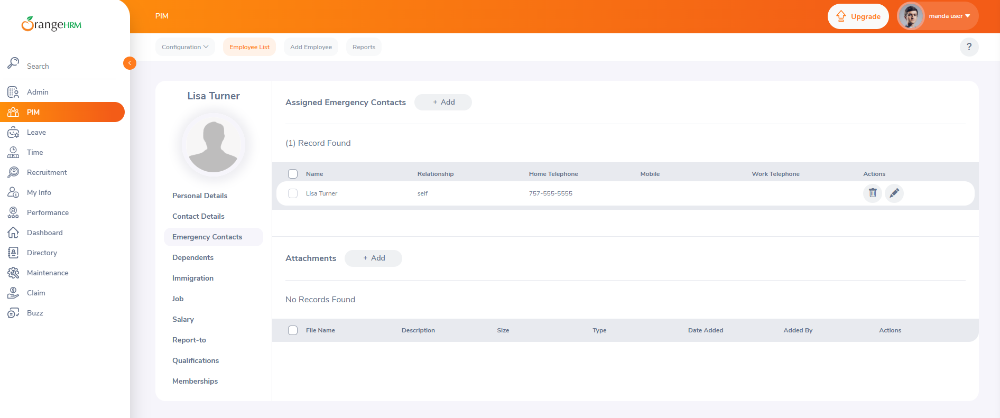

# 🐞 Defect 01 – User Can Add Themselves as Emergency Contact

**Module:** My Info → Emergency Contacts  
**Severity:** Normal  
**Priority:** Medium  
**Status:** Open  
**Environment:** Chrome v135.0.7049.96, Windows 11  
**Discovered in:** OE-4 – Add Self as Emergency Contact

---

## 🔍 Description
The system allows a user to add themselves as their own emergency contact. This introduces a business logic flaw, as emergency contacts should be third-party individuals.

---

## 🧪 Steps to Reproduce
1. Login to [https://opensource-demo.orangehrmlive.com](https://opensource-demo.orangehrmlive.com)  
2. Navigate to **My Info → Emergency Contacts**  
3. Click **Add**  
4. Enter the logged-in user’s own name in the **Name** field  
5. Set **Relationship** to "Self"  
6. Fill in required contact fields and click **Save**

---

## ✅ Expected Result
Validation error should prevent the user from saving themselves as their own emergency contact.

## ❌ Actual Result
System allows the save and displays the user as their own emergency contact.

## 📸 Screenshot

