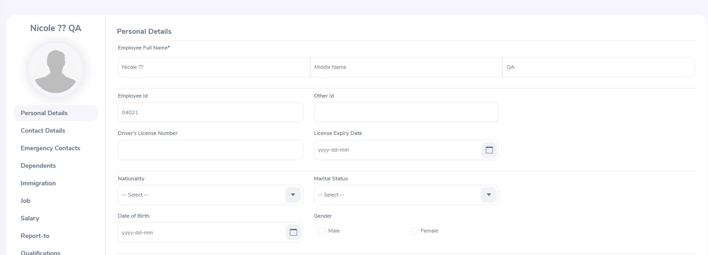

# 🐞 Defect 02 – Emoji Characters in Name Field Render as Question Marks

**Module:** PIM → Add Employee  
**Severity:** Minor  
**Priority:** Low  
**Status:** Open  
**Environment:** Chrome v135.0.7049.96, Windows 11  
**Discovered in:** OE-5 – Add Emoji in Name Field

---

## 🔍 Description
The system accepts emoji input in the First Name field, but renders them as question marks (`??`) after saving. No validation warning is shown during entry.

---

## 🧪 Steps to Reproduce
1. Login to [https://opensource-demo.orangehrmlive.com](https://opensource-demo.orangehrmlive.com)  
2. Go to **PIM → Add Employee**  
3. Enter:  
   - First Name: `Nicole 💅🏽`  
   - Last Name: `QA`  
4. Save the form  
5. View the employee in the **Employee List**

---

## ✅ Expected Result
System should either reject the emoji with a validation error **or** store and display it correctly.

## ❌ Actual Result
Emoji is replaced by `??` in the saved record. User receives no feedback that this occurred.

---

## 📸 Screenshot

