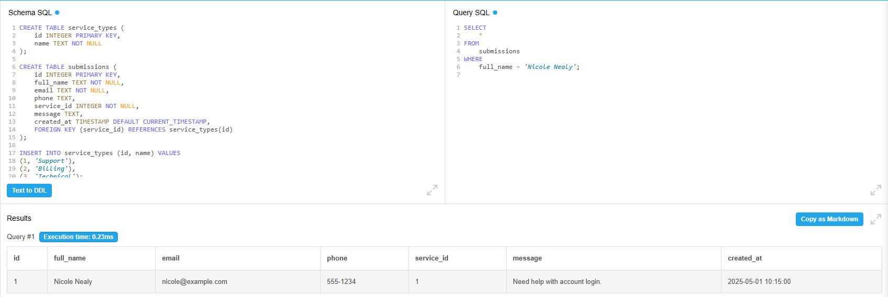
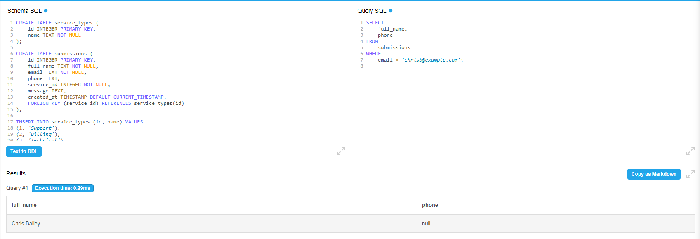
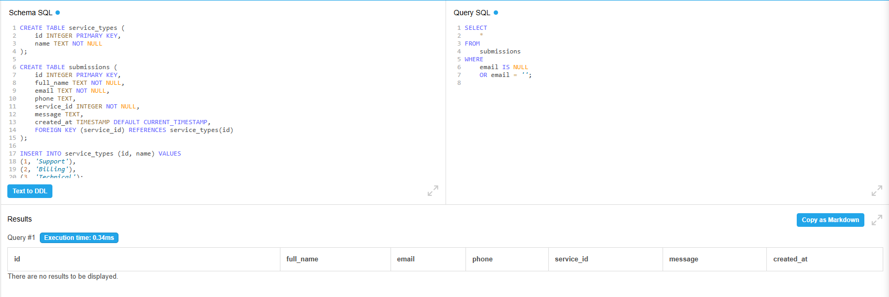
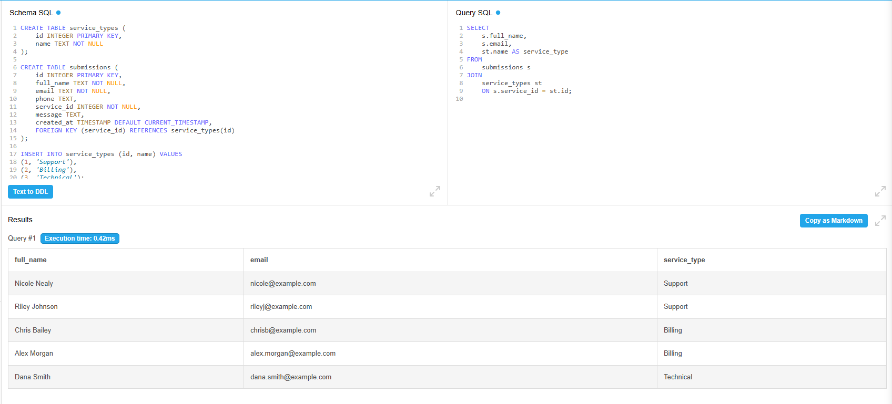
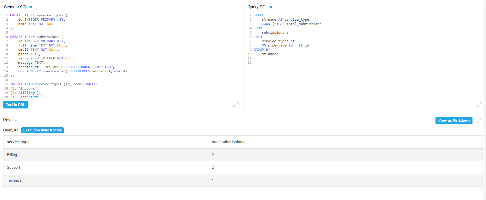

# 📊 Form Submission Tracker – SQL Data Validation

This project simulates a basic form submission workflow, where user input from a web form is stored in a backend database. The goal is to validate that frontend behaviors (like submitting or skipping fields) are accurately reflected in the database records. This type of QA testing is common in real-world scenarios involving contact forms, billing support, and service requests — including the types of workflows Bottomline might handle in a financial tech environment.

---

## 🗂️ Project Files

```text
form-submission-sql-project/
├── 01_README.md              # Project overview and test case walkthrough
├── 02_schema.sql             # SQL table creation for service_types and submissions
├── 03_insert_data.sql        # Dummy form submissions
├── 04_queries.sql            # QA validation queries
├── 05_test-cases.csv         # Manual test case matrix
└── screenshots/              # Screenshots of executed queries
```

---

## ⚙️ Setup Instructions

This project was executed in [DB Fiddle](https://www.db-fiddle.com/) using SQLite.  
I pasted the schema and inserts from `schema.sql` and `insert_data.sql`, then ran the queries in `queries.sql`.

---

## 🧪 SQL-Based QA Test Cases

### TC01 – Confirm Valid Submission Stored

**Query**

```sql
SELECT 
    *
FROM 
    submissions
WHERE 
    full_name = 'Nicole Nealy';
```

**Expected Result**  
Returns 1 row with correct details and timestamp.




---

### TC02 – Missing Phone Saved as NULL

**Query**

```sql
SELECT 
    full_name, 
    phone
FROM 
    submissions
WHERE 
    email = 'chrisb@example.com';
```

**Expected Result**  
Phone field should return NULL or empty.




---

### TC03 – Check for Missing or Blank Emails

**Query**

```sql
SELECT 
    *
FROM 
    submissions
WHERE 
    email IS NULL 
    OR email = '';
```

**Expected Result**  
Returns any records where email field is empty or null.




---

### TC04 – Join to Show Service Type Name

**Query**

```sql
SELECT 
    s.full_name, 
    s.email, 
    st.name AS service_type
FROM 
    submissions s
JOIN 
    service_types st 
    ON s.service_id = st.id;
```

**Expected Result**  
Displays all submissions along with their related service type name.



---

### TC05 – Count Submissions by Service Type

**Query**

```sql
SELECT 
    st.name AS service_type, 
    COUNT(*) AS total_submissions
FROM 
    submissions s
JOIN 
    service_types st 
    ON s.service_id = st.id
GROUP BY 
    st.name;
```

**Expected Result**  
Returns a grouped count of submissions by service type.



---

## ✅ Skills Demonstrated

- SQL validation of real-world QA workflows  
- Manual test case creation mapped to backend checks  
- JOINs, filtering, NULL handling, and data grouping  
- Demonstrated understanding of backend data integrity  
- Ability to test UI logic using SQL-only tools

---

## 🧠 Bonus Ideas for Expansion

- Add defect markdowns to simulate found issues  
- Create a UAT signoff document  
- Automate checks with Python or Postman in the future  
